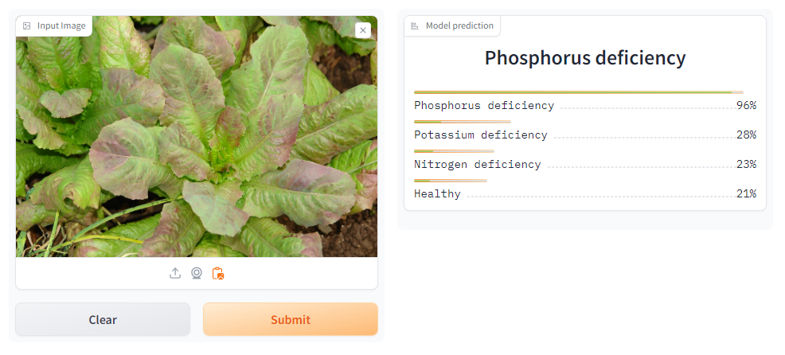

Lettuce (Lactuca sativa) is a widely cultivated leafy green vegetable, prized for its nutritional value and crisp texture. The optimal growth of lettuce relies on a balanced supply of essential nutrients, with Nitrogen (N), Phosphorus (P), and Potassium (K) playing crucial roles. Monitoring and addressing nutrient deficiencies are pivotal for maximizing crop yield and quality. **This repository proposes a simple app for predicting lettuce nutrient deficiency from lettuce images using deep learning.**

The app is deployed on Hugging Face at this link : [🥬Lettuce NPK Deficiency Prediction](https://huggingface.co/spaces/AbdoulayeDIOP/lettuce-npk-deficiency-prediction)

<!-- Check out the configuration reference at https://huggingface.co/docs/hub/spaces-config-reference -->

